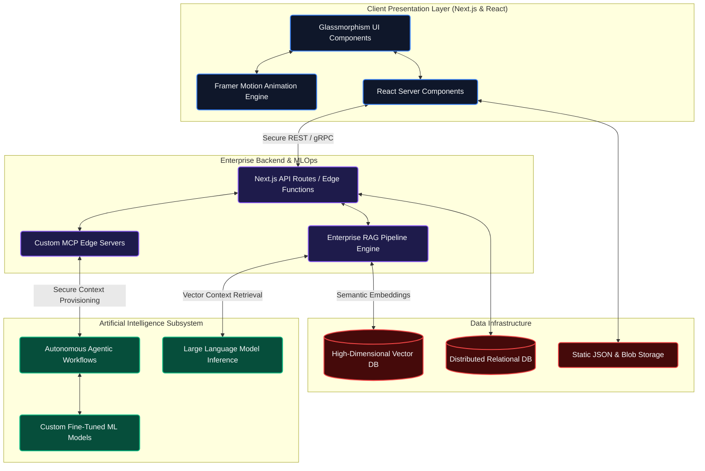

# Adil Munawar - Software Engineering Portfolio

## Overview
A comprehensive digital portfolio showcasing enterprise-grade full-stack systems engineering, artificial intelligence integrations, and advanced cloud architectures. Built with a focus on performance optimization, scalable design, and high-concurrency environments.

## Core Capabilities
* Full-Stack Web Development (Next.js, TypeScript, React)
* Machine Learning and AI Integration
* Enterprise RAG (Retrieval-Augmented Generation) Pipelines
* Custom MCP (Model Context Protocol) Server Architectures
* Cloud Infrastructure and MLOps
* Autonomous Agentic Workflows

## Technical Architecture

## Project Structure
The repository follows a modular, feature-based architectural pattern:
* `/src/components`: Contains highly encapsulated, reusable React components including specialized data visualizers, interactive cards, and layout wrappers.
* `/src/lib`: Core utilities, data fetching logic, and static JSON data configurations.
* `/public`: Static assets, optimized imagery, and certification verification documents.
* `/scripts`: Build and automation scripts for continuous integration and metric aggregation.

## Setup and Installation

### Prerequisites
* Node.js 20.x or higher
* npm or yarn package manager

### Local Development
1. Clone the repository
2. Install dependencies: `npm install`
3. Start the development server: `npm run dev`
4. Access the local environment at `http://localhost:3000`

### Build Process
Execute the following command to generate an optimized production build:
`npm run build`

## Licensing and Usage
This repository serves as a personal portfolio and demonstration of technical proficiency. All source code is proprietary unless explicitly stated otherwise.
